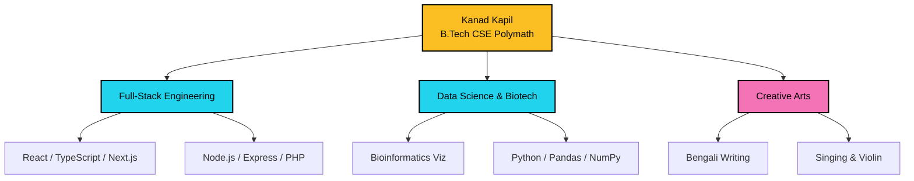

# ✦ Kanad Kapil

<p align="center">
  <a href="https://github.com/kanadkapil">
    
  </a>
  <a href="https://www.linkedin.com/in/kanadkapil/">
    
  </a>
  <a href="mailto:kanad.kapil@gmail.com">
    
  </a>
  <a href="https://www.instagram.com/kanad.kapil/">
    
  </a>
  <a href="https://www.youtube.com/@kanadkapil">
    
  </a>
</p>

---

## ⚡️ Who is Kanad Kapil?

I am an enthusiastic, reliable, and self-motivated final-year **B.Tech student in Computer Science & Engineering** at **Lovely Professional University (LPU)**. I specialize in modern full-stack web engineering and data analytics, bridging the gap between high-performance code and deep data insights.

Beyond the keyboard, I am a polymath who finds balance in artistic expression as a **Bengali writer, singer, and violinist**. I believe the disciplined structure of music and literature directly informs my approach to clean, maintainable, and creative code.

---

## 🔬 Engineering Philosophy

We can represent the ideal engineering approach through the following function:

$$\text{Software Engineering} = f(\text{Logic}, \text{Data}, \text{Creativity})$$

where:
*   $\text{Logic}$ represents robust full-stack architecture ($\text{Next.js} + \text{TypeScript} + \text{Express}$).
*   $\text{Data}$ represents bioinformatics sequence mapping and Exploratory Data Analysis.
*   $\text{Creativity}$ represents the structural rhythm of classical violin, vocals, and literary narratives.

---

## 🗺️ Polymath Skill Architecture

Here is how my technical and creative disciplines connect:



---

## 🛠️ Skills & Stack

| Category | Skills |
| :--- | :--- |
| **Languages** | `C++` `Python` `JavaScript` `HTML5` `Markdown` |
| **Frontend** | `React` `TypeScript` `Tailwind CSS` `DaisyUI` `Bootstrap` `CSS Modules` |
| **Backend & Security** | `Node.js` `Express.js` `PHP` `REST APIs` `JWT` `bcrypt` |
| **Database & Query** | `SQL` `MongoDB` `MySQL` `JSON` `CSV` |
| **Data Science & AI** | `Pandas` `NumPy` `Naive Bayes (MNB)` `Scrapy` `Data Cleaning (EDA)` |
| **Tools & Visualizations** | `Git & GitHub` `Vercel` `Postman` `D3.js Visualization` `Streamlit` `Matplotlib` |

---

## 📈 Featured Projects

| Project Name | Stack | Description | Live Demo |
| :--- | :--- | :--- | :--- |
| **Protein Sequence Analysis** | `React`, `Bioinformatics`, `EDA` | A sophisticated EDA and visualization platform for structural bioinformatics, focusing on bridging the sequence-structure gap using BiLSTM networks. | [Live Demo](https://eda-viz-protein-sequence-analysis.vercel.app/) |
| **AlgoViz** | `React`, `TypeScript`, `Algorithms` | Interactive algorithm visualization platform designed to simplify complex logic through real-time graphical representations of sorting and pathfinding. | [Live Demo](https://algoviz-eta.vercel.app/) |
| **IPL 2025 Bowler Stats** | `Python`, `Streamlit`, `Analytics` | Real-time cricket analytics dashboard providing deep insights into bowler performance stats for the 2025 IPL season. | [Live Demo](https://ipl-2025-bowler-stats.streamlit.app/) |
| **React Note Card** | `React`, `UI/UX`, `Frontend` | A productivity-focused note-taking application using a modern card-based UI, optimized for quick reflections and organized data entry. | [Live Demo](https://react-note-card.vercel.app/) |
| **Brainfuck Interpreter** | `JavaScript`, `Logic`, `Web` | A web-based interpreter for the Brainfuck esoteric programming language, featuring real-time memory visualization. | [Live Demo](https://kanadkapil.github.io/Web-Works-Live/Brainfuck/index.html) |

---

## 🎓 Education & Credentials

### Academic Journey

| Degree | Year | Subject / Branch | Institution | Score |
| :--- | :--- | :--- | :--- | :--- |
| **B.Tech** | 2026 | Computer Science & Engineering | Lovely Professional University (LPU) | `7.0 / 10.0` |
| **HSC (12th)** | 2020 | Science (PCMB) | MPSC | `4.75 / 5.00` |
| **SSC (10th)** | 2018 | Science (PCMB) | WLFSC | `4.78 / 5.00` |

### Key Certifications

*   **Complete Web Development Bootcamp** — *Udemy (61 Hours)*
*   **Python Programs for Beginners** — *Udemy (2 Hours)*
*   **Front End Developer (HTML)** — *Great Learning*
*   **Types of Cyber Security** — *Great Learning*
*   **SSO Digital Certificate** — *National (mysso.gov.bd)*

---

## 📊 Live GitHub Insights

<p align="center">
  
  
</p>
<p align="center">
  
</p>

---

## ⚙️ Running this Project Locally

1. **Clone the repository**
   ```bash
   git clone https://github.com/kanadkapil/Personal-Portfolio-Live-main.git
   cd Personal-Portfolio-Live-main
   ```
2. **Install dependencies**
   ```bash
   npm install
   ```
3. **Start the development server**
   ```bash
   npm run dev
   ```
4. **Compile for production**
   ```bash
   npm run build
   ```
